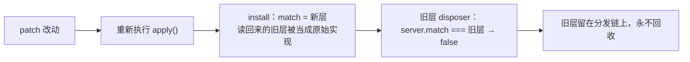

给 dsh web 写了个登录网关插件，靠包住 `webServer` 的 `match(pathname)` 分发点拦住所有请求。改一行配置、保存，几秒内就生效，看起来一切正常；直到把插件行停用——网关**一点没撤**，请求照样被拦到飞书登录页。进程没重启，日志里也没有任何异常。

不是 loader 没处理停用，是插件的卸载守卫写错了：它用 `server.match === gateMatch` 判断「我装的层还在不在」。在 Cordis 里这个判断永远是 false。

## 服务成员经 ctx 读一次就是新对象

dsh 的 `webServer` 是一个 Cordis `Service`。经 ctx 读服务和它的方法，拿到的都是 traceable 代理：

```js
// cordis 4.0.2 = dsh 0.1.5-rc.1 自带的那份，get 陷阱节选
get: (target, prop, receiver) => {
  const innerTracker = innerValue?.[symbols.tracker]
  if (innerTracker) {
    return createTraceable(ctx, innerValue, innerTracker)
  } else if (!tracker.noShadow && typeof innerValue === 'function') {
    shadow ??= createShadow(ctx, target, tracker.property, receiver)
    return createShadowMethod(ctx, innerValue, receiver, shadow)   // ← 每次读都 new Proxy
  }
  return innerValue
},
set: (target, prop, value, receiver) => Reflect.set(target, prop, value, shadow)
```

函数值成员走 `createShadowMethod`，也就是**每次属性读取都新建一个 Proxy**。这是有意设计的：调用被归属到调用方上下文，便于追踪。副作用是：

- `server.match === server.match` 为 false；
- 写进去的东西读回来不是同一个对象，`===` 比较必然失败；
- 但**写是生效的**（set 陷阱落到目标上），所以拦截本身工作正常——失效的只有「判断我的层还在不在」这一步，而且是静默的：不抛错、不打日志。

于是卸载守卫变成空操作，旧层留在分发点链上，网关永久粘住。而 dsh 的 profile patch 是 live 重载（`dsh.profile.patchReload: live`），每改一次配置就重新执行一次 `apply()`，所以层数会随使用一层层累积。

## 最小复现

不依赖 dsh 仓库，直接 import cordis 就能复现：

```js
import { Context, Service } from '@deepseek-ai/cordis'

const ORIGINAL = Symbol.for('cordis.original')
const LAYER = Symbol.for('demo.dispatcher')

class WebServer extends Service {
  constructor(ctx) {
    super(ctx, 'webServer')
    this.routes = new Map([['/dashboard', 'dashboard-route']])
  }
  match(pathname) { return this.routes.get(pathname) }
}

const app = new Context()
app.plugin((ctx) => {
  const instance = new WebServer(ctx)
  console.log(ctx.webServer === ctx.webServer)             // false
  console.log(ctx.webServer.match === ctx.webServer.match) // false
  console.log(ctx.webServer[ORIGINAL] === instance)        // true（解包口可用）

  const server = ctx.webServer
  const original = server.match
  const gate = function gateMatch(p) { gateMatch.installed = true; return original.call(server, p) }
  server.match = gate

  // 身份比较式卸载
  if (server.match === gate) server.match = original
  console.log(server.match.installed)   // true —— 层还在

  // 标记式卸载
  gate[LAYER] = { gate, original }
  if (server.match?.[LAYER]?.gate === gate) server.match = original
  console.log(server.match.installed)   // undefined —— 真撤掉了
})
```

实测输出：

```
ctx.webServer === ctx.webServer                 false
ctx.webServer.match === ctx.webServer.match     false
ctx.webServer[Symbol.for('cordis.original')]    可用（解包到原始实例）
身份比较式卸载后，层是否还在                       在（静默失败）
标记式卸载后，层是否还在                          已卸载
```

一个容易误判的点：**loader 侧其实照做了**。`Entry.update()` 里写着 `if (this._disabled(candidate)) await this._dispose(previous)`，插件注册的卸载 effect 也确实被执行了。失效点只在插件自己的守卫里。这解释了一个不对称现象——改配置热生效、停用不生效：配置由最外层（最新那层）决定，而停用需要把每一层都拆干净。

## 正确的挂载与卸载

三件事：

1. 标记放在函数对象上，键用 `Symbol.for(...)`；标记值里存下真正的原始实现。
2. 按**原始服务对象**记录当前层：`server[Symbol.for('cordis.original')]` 拿原始实例当 key，因为每次读 ctx 得到的代理对象本身也不同。
3. 安装时若分发点已带本插件的标记（历史残留层），复用它的 original，不再往上叠；卸载时只在自己仍是最新层时才还原。

```js
const CORDIS_ORIGINAL = Symbol.for('cordis.original')
const DISPATCHER = Symbol.for('my-plugin.dispatcher')
const installedByServer = new WeakMap()

function install(server) {
  const current = server?.match
  const key = server?.[CORDIS_ORIGINAL] ?? server
  const leftover = current[DISPATCHER]
  const original = typeof leftover?.original === 'function' ? leftover.original : current
  const gateMatch = function gateMatch(pathname) {
    return {
      kind: 'exact',
      path: pathname,
      handler: (req, res) => dispatch(req, res, original.call(server, pathname), server),
    }
  }
  gateMatch[DISPATCHER] = { gateMatch, original }
  server.match = gateMatch
  installedByServer.set(key, gateMatch)
  return () => {
    // 已被更新的层接管
    if (installedByServer.get(key) !== gateMatch) return
    // 自己不在最外层了
    if (server.match?.[DISPATCHER]?.gateMatch !== gateMatch) return
    server.match = original
    installedByServer.delete(key)
  }
}
```

第 2 条里的「新层先挂、旧层后拆」是实测顺序：热重载时新层的 install 与旧层的 dispose 在同一毫秒交替出现。不判断「自己是不是最新层」的话，旧层的卸载会把刚装上的新层一起拆掉。



## 自查

- 不要比较服务成员的身份。`ctx.<service>.<method>` 读出来是新对象，`===` 恒为 false；要识别自己的层就用符号标记。
- 想拿原始实现，用 `Symbol.for('cordis.original')` 解包。它注册在全局符号表里，不依赖 import cordis。
- 包裹长寿命服务实例、并在卸载时判断「我还在不在最外层」的插件，都得处理重载顺序——新层可能先于旧层的 disposer 挂上。

影响面不止 `webServer.match`。任何包裹服务成员、并在卸载时做身份判断的插件都会踩同一个坑，而 dsh 这种 live 重载的 profile 会让残留层随改动累积。
