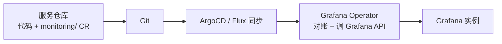

监控栈（Grafana + Prometheus）已经用 Helm 部署在 K8s 上，指标在服务代码里暴露，但 dashboard 和告警规则还在靠 UI/API 手动维护。想做到「指标、报表、告警规则都在仓库里、由服务自己维护」——在纯 Helm + K8s 的约束下，答案是 **Grafana Operator**，不是 Terraform。

## 先理清「版本」和「数据源引用」

Dashboard Provisioning 的 YAML 里 `apiVersion: 1` 是配置清单的格式版本，跟 dashboard 内容无关，日常写 provision 只需要管它。dashboard JSON 里另有 `schemaVersion`（内容结构版本，加载旧版时 Grafana 自动跑迁移脚本）和新版引入的资源版本 `apiVersion`（如 `dashboard.grafana.app/v1`）。

dashboard 定义里数据源靠 UID 引用，不内嵌配置：

```json
"datasource": { "type": "prometheus", "uid": "prometheus" }
```

数据源本身的增删改走独立途径：UI、HTTP API（`/api/datasources`）、Provisioning YAML、或 Terraform。

## 管理途径对比

| 途径 | 机制 | 定位 |
|------|------|------|
| UI / HTTP API | 手动 / 脚本调用 | 调试、一次性操作 |
| Provisioning | 挂载 YAML 文件 | 容器化打包配置 |
| Terraform | 外部工具，provider 调 API | 跨平台编排、严格审计回滚 |
| Grafana Operator | K8s CRD 声明式 | Helm+K8s 体系、GitOps |

Terraform 是通用 IaC（声明式 + state + provider），但引入了 K8s 生态外的工具和状态文件管理。要在纯 Helm + K8s 里做，Grafana Operator 更自然。

## 关键前提：kube-prometheus-stack 不含 Grafana Operator

`kube-prometheus-stack` 带的是 **Prometheus Operator**（管 Prometheus/Alertmanager/ServiceMonitor/PrometheusRule），不是 Grafana Operator。Grafana Operator 是独立项目，要单独部署。

两者搭配的坑：kube-prometheus-stack 默认自己部署一个 Grafana 实例，再上 Grafana Operator 会两个组件抢着管 Grafana。做法是把内置 Grafana 关掉（`grafana.enabled: false`），让 Operator 独立管理 Grafana 实例 + dashboard + 告警 + 数据源。

## 三种 CR 走通「服务自维护」

用 Grafana Operator 后，dashboard、告警、数据源都变成 CR，随服务一起部署：



Counter 指标 `task_completed_total{service="a-service"}` 的 dashboard（`GrafanaDashboard` CR，`json` 字段内嵌标准 dashboard JSON）：

```yaml
apiVersion: grafana.integreatly.org/v1beta1
kind: GrafanaDashboard
metadata:
  name: a-service-dashboard
  namespace: monitoring
spec:
  instanceSelector:
    matchLabels:
      dashboards: "grafana"
  folderRef: "a-service"
  json: |
    {
      "title": "A Service Overview",
      "uid": "a-service-overview",
      "panels": [{
        "title": "任务完成数量 (最近 1h)",
        "type": "stat",
        "datasource": { "type": "prometheus", "uid": "prometheus" },
        "targets": [{ "expr": "increase(task_completed_total{service=\"a-service\"}[1h])", "refId": "A" }]
      }]
    }
```

告警规则走 `GrafanaAlertRuleGroup`，链路是「查询 → Reduce 降维 → Threshold 阈值 → condition」：

```yaml
apiVersion: grafana.integreatly.org/v1beta1
kind: GrafanaAlertRuleGroup
metadata:
  name: a-service-alerts
  namespace: monitoring
spec:
  instanceSelector:
    matchLabels: { dashboards: "grafana" }
  folderRef: "a-service"
  interval: 5m
  groups:
    - name: task-completion
      rules:
        - uid: a-service-task-low
          title: "A服务任务完成数量过低"
          condition: C
          for: 5m
          data:
            - refId: A
              datasourceUid: prometheus
              relativeTimeRange: { from: 3600, to: 0 }
              model:
                editorMode: code
                expr: increase(task_completed_total{service="a-service"}[1h])
            - refId: B
              datasourceUid: __expr__
              model:
                type: reduce
                expression: A
                reducer: last
            - refId: C
              datasourceUid: __expr__
              model:
                type: threshold
                expression: B
                conditions:
                  - evaluator: { type: lt, params: [100] }
```

服务仓库里的组织：

```
a-service/
├── src/
├── deploy/
│   ├── deployment.yaml
│   └── service.yaml
└── monitoring/
    ├── folder.yaml
    ├── dashboard.yaml
    └── alert.yaml
```

## 注意

- **Reduce 必不可少**：Grafana 告警只能基于数值触发，必须先用 Reduce 把时间序列降维成标量再 Threshold 比较。报 `invalid format of evaluation results` 多半是 `condition` 指到了查询表达式而非 Reduce 之后的。
- **resyncPeriod 会覆盖 UI 改动**：Operator 默认每 10 分钟对账一次，你在 UI 上手动改的 dashboard 会被下一次轮询覆盖。走 Operator 后约定一切变更走 Git 提交 CR，不在 UI 上直接改生产。
- **数据源 UID 要对上**：`datasourceUid` 要和 Grafana 里实际的 Prometheus 数据源 UID 一致。数据源通常由平台团队统一配一次，服务方只引用。
- **Counter 用 increase**：算「最近 1h 完成数」用 `increase(metric[1h])`，不能直接查累计值。
