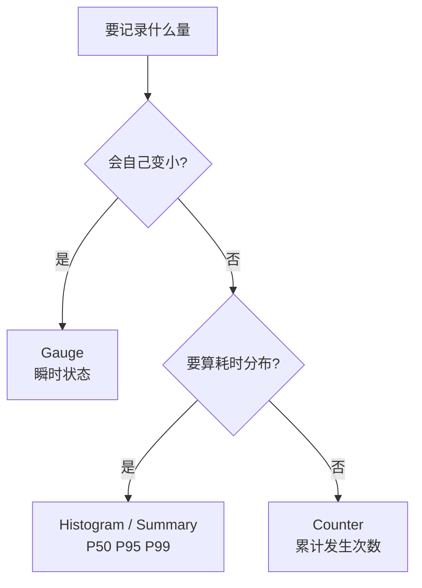

统计「任务每小时/每天平均完成多少」，或者暴露「当前排队多少」——答案取决于选对指标类型。选错类型，`rate()` 算出来的就是废数。

核心一句话：**Counter 记累计，查询时用 `rate`/`increase` 做窗口聚合；Gauge 记瞬时状态；Histogram 记耗时分布。**

## Counter：累计发生次数

任务完成数、请求数、错误数这类「只增不减」的量，一律 Counter。

```prometheus
task_completed_total{task_type="etl", status="success"} 12345
```

标签只放低基数维度（`task_type`、`status`、`queue`）。`task_id`、`trace_id` 这类高基数标签绝对不能放，会撑爆内存。

Go client 定义：

```go
var taskCompletedTotal = prometheus.NewCounterVec(
    prometheus.CounterOpts{
        Name: "task_completed_total",
        Help: "Total number of completed tasks.",
    },
    []string{"task_type", "status"},
)

taskCompletedTotal.WithLabelValues("etl", "success").Inc()
```

### 查询

`rate()` 返回每秒速率，乘 3600 就是每小时；`increase()` 直接返回窗口增量。多副本各自累加，`sum(rate(...))` 天然汇总。

```promql
# 平均每小时完成数
sum(rate(task_completed_total{status="success"}[1h])) * 3600

# 过去 24 小时平均每天完成数（increase 等价写法）
sum(increase(task_completed_total{status="success"}[24h]))

# Grafana 面板选中的时间段
sum(increase(task_completed_total{status="success"}[$__range]))
```

两个坑：

- 时间窗口要 ≥ 2× 抓取间隔，否则 `rate` 样本不足返回空。15s 抓取至少用 `[1m]`。
- `increase` 是外推估算，边界有误差。要精确账单级统计就上日志/数仓，Prometheus 只做趋势。

## Gauge：瞬时状态

判断标准一句话：**这个数字会不会自己变小？会 → Gauge。**

典型场景：

```prometheus
# 当前运行中 / 排队中
task_running 42
task_queue_pending 128

# 资源占用（绝对值）
process_resident_memory_bytes 1.2e8
node_filesystem_avail_bytes 5.3e10

# 比率 / 饱和度
node_cpu_usage_percent 73.5
thread_pool_saturation 0.65

# 环境量
node_hwmon_temp_celsius 65
node_load1 2.3

# 配置阈值 / 上限（配合其他指标算使用率）
db_max_connections 100
queue_capacity 1000

# 最新事件时间戳
last_sync_timestamp_seconds 1694500000
```

查询逻辑和 Counter 相反——直接取值，或 `avg/max/min_over_time` 看一段时间的均值/峰值：

```promql
task_running
avg_over_time(task_running[1h])
max_over_time(task_running[1h])
delta(task_queue_pending[1h])   # 窗口首尾差
deriv(task_queue_pending[1h])   # 变化速率
```

**绝对不要对 Gauge 用 `rate()`/`increase()`**——Gauge 会下降，算出来是无意义甚至负数。Gauge 噪声大，告警一般配 `for: 5m` 或先 `avg_over_time` 平滑。

## 选型



对应到任务场景：

| 指标 | 类型 |
|------|------|
| `task_completed_total` 累计完成数 | Counter |
| `task_running` 当前运行中 | Gauge |
| `task_queue_pending` 当前排队 | Gauge |
| `task_duration_seconds` 耗时分布 | Histogram |

## 常见误区

- 用 Gauge 记累计完成数：重启归零、被重置后历史速率算不准。累计量用 Counter。
- 用 Counter 记当前在线数：只会增，反映不了下线，语义错乱。
- 对 Gauge 用 `rate`/`increase`：无意义甚至负数。
- 抓取间隔 5m 却查 `rate(...[1m])`：样本不足，完全没数据。

---

> 本文基于与 DeepSeek 的一次对话整理，原始对话：https://chat.deepseek.com/share/uc146n82x33u9sf3e3
